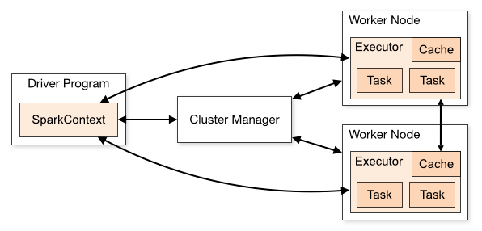
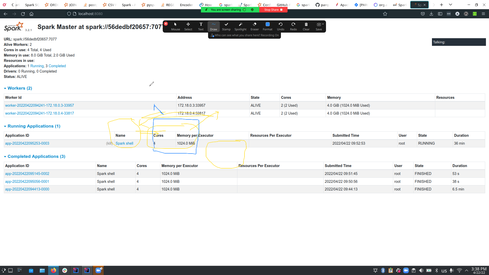

# Driver Role
It contains following components such as DAG Scheduler, task scheduler, backend scheduler and block manager. The driver translates user code into a specified job. Afterwards, which we execute over the cluster.

*  It schedules the job execution and negotiates with the cluster manager.
*  This driver program translates the Dataframe/Dataset => RDDs then Rdd into execution graph. It also splits the graph into multiple stages.
* It stores the metadata about all RDDs as well as their partitions.
*  This driver program creates tasks by converting applications into small execution units. After that executor executes the task, the worker processes which run individual tasks.

3. Role of  Apache Spark  Executor

To execute several tasks, executors play a very important role. They are distributed agents those are responsible for the execution of tasks. Each application has its own executor process.
Executors actually run for the whole life of a spark application. That is “Static Allocation of Executors” process.
Users can also select for dynamic allocations of executors. We can also add or remove spark executors dynamically according to overall workload.
* It performs all the data processing.
* Executors Write data to external sources. They also read data from external sources.
* We can store computation results in-memory. It is also possible to store data in cache as well as on hard disks.
* Executors do interact with the storage systems.

https://data-flair.training/blogs/wp-content/uploads/sites/2/2017/08/Internals-of-job-execution-in-spark.jpg

