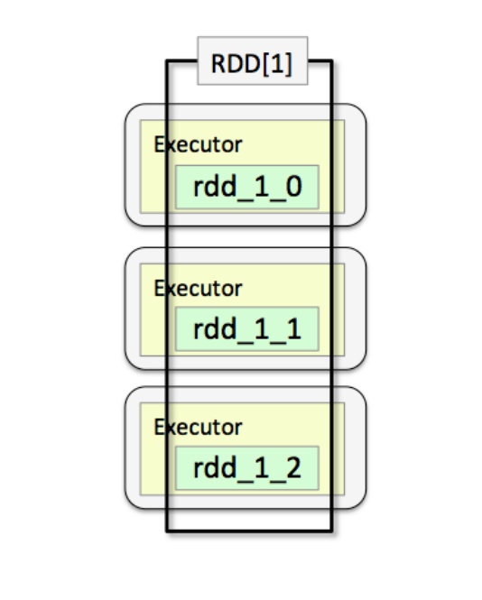
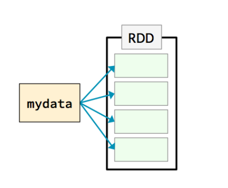
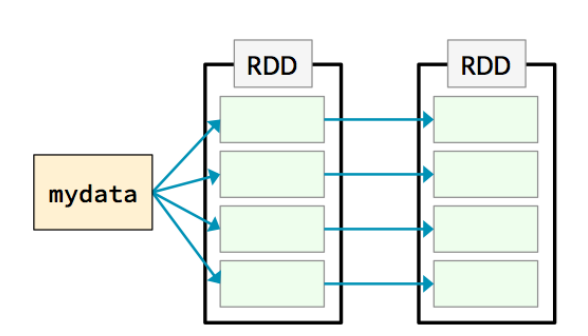
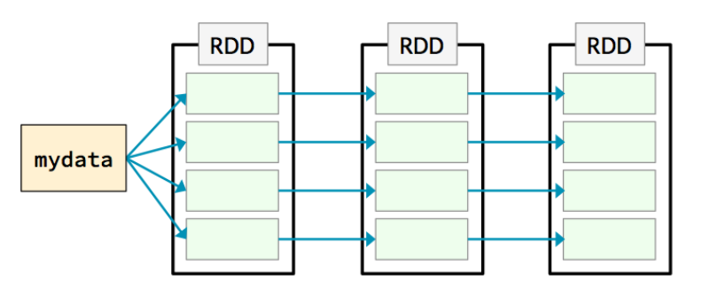
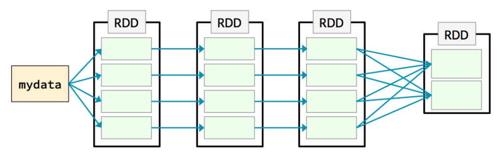
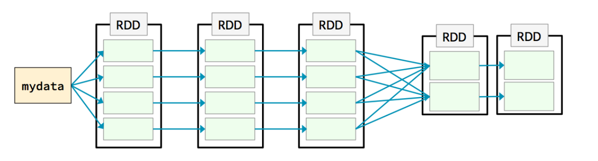
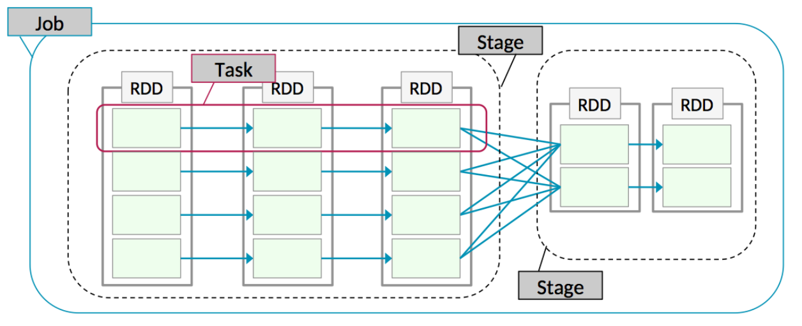
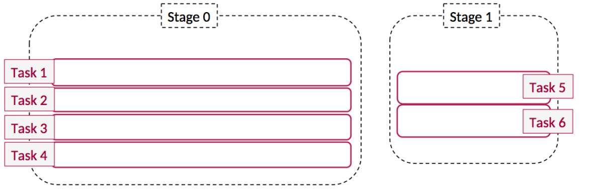
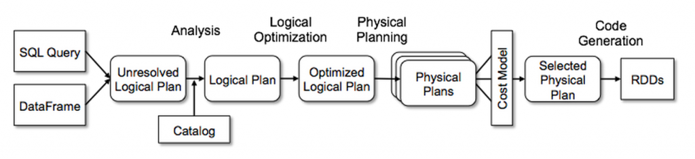

# RDD on a spark cluster



## Create rdd
```scala
val rdd:RDD[String] = sc.textFile("/some/path")
```


## transform it via flatmap narrow dependency
```scala
val rdd = sc.textFile("/some/path")
.flatMap(_.split(' '))
```


## transform it via map narrow dependency
```scala
val rdd = sc.textFile("/some/path")
  .flatMap(_.split(' '))
  .map(w=> (w,w.length))
```


## group by wide dependency
```scala
val rdd = sc.textFile("/some/path")
  .flatMap(_.split(' '))
  .map(w=> (w,w.length))
  .groupByKey()
```


## transform again narrow dependency
```scala
val rdd = sc.textFile("/some/path")
  .flatMap(_.split(' '))
  .map(w=> (w,w.length))
  .groupByKey()
  .mapValues(i => i.foldLeft((0,0)){case (z,v) => (z._1+v,z._2+1)} ).mapValues(i=>i._1.toDouble/i._2)
rdd.saveAsTextFile("/some/output/path")
```


## over all job




* Job:a set of tasks executed as a result of an action
* Stage:a set of tasks in a job that can be executed in parallel
* Task:an individual unit of work sent to one executor
* Application:the set of jobs managed by a single driver

# Dataframe/Dataset execution

