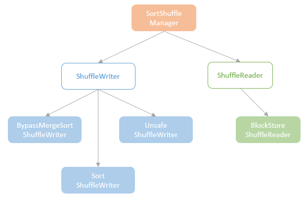
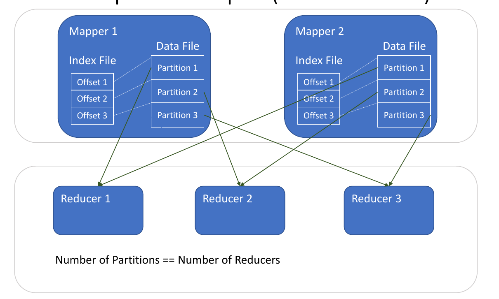
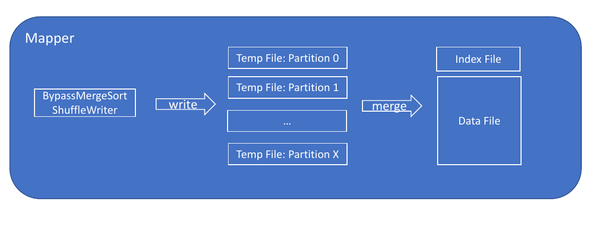
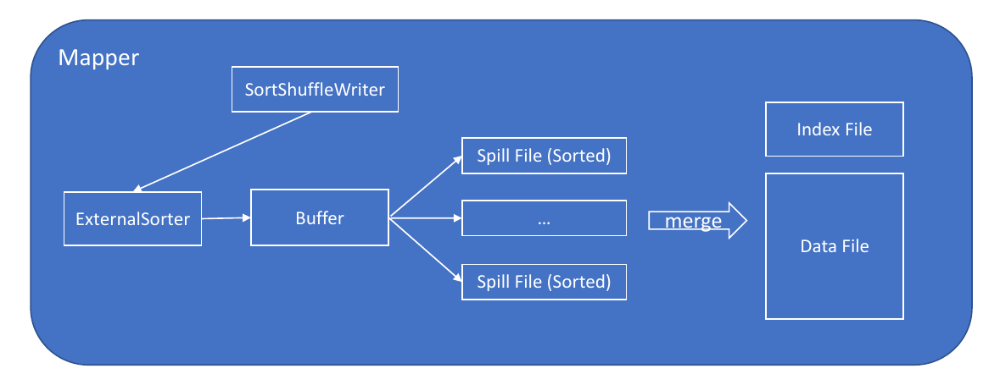
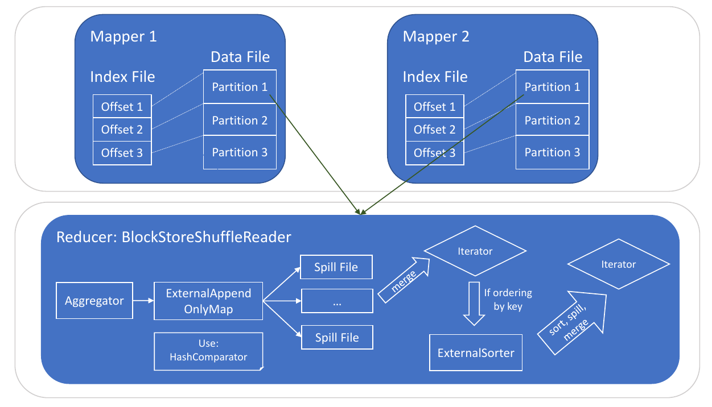

# High Level Abstraction
* Pluggable Interface: ShuffleManager
  - registerShuffle(...)
  - getWriter(...)
  - getReader(...)
* Configurable: spark.shuffle.manager=xxx
* Mapper: ShuffleWriter
  - write(records: Iterator)
* Reducer: ShuffleReader
  - read(): Iterator

# Implementations
* SortShuffleManager (extends ShuffleManager)
* Three Writers (optimized for different scenarios)
  - SortShuffleWriter: uses ExternalSorter
  - BypassMergeSortShuffleWriter: no sorter
  - UnsafeShuffleWriter: uses ShuffleExternalSorter
* One Reader
  - BlockStoreShuffleReader, uses
    * ExternalAppendOnlyMap
    * ExternalSorter (if ordering)
    

# writer output example

# Three Shuffle Writers
* Different Writer Algorithms
  - SortShuffleWriter
  - BypassMergeSortShuffleWriter
  - UnsafeShuffleWriter
* Used in different situations (optimizations)
* Things to consider
  - Reduce total number of files
  - Reduce serialization/deserialization when possible

# When Different Writers Are Used?
* Small number of partitions? 
  * BypassMergeSortShuffleWriter
* Able to sort record in serialized form?
  * UnsafeShuffleWriter
* Otherwise
  * SortShuffleWriter

# BypassMergeSortShuffleWriter one file for each partition merge them

* No map side combine
* Number of partitions < spark.shuffle.sort.bypassMergeThreshold
* Pros
  * Simple
* Cons
  * 1 to 1 mapping between temp file and partition
  * Many temp files

# SortShuffleWriter

* Why sort?
  * Sort records by PartitionId, to separate records by different partitions
  * Reduce number of files: number of spill files < number of partitions
* Buffer (in memory):
  * PartitionedAppendOnlyMap (when there is map side combine)
  * PartitionedPairBuffer (when there is no map side combine)
* Used when
  * Has map side combine, or, many partitions
  * Serializer supports record relocation
* Pros
  * Flexible, support all shuffle situations
* Cons
  * Serialize/deserialize multiple times

spark.shuffle.spill.initialMemoryThreshold
spark.shuffle.spill.numElementsForceSpillThreshold

# UnsafeShuffleWriter
* Record serialized once, then stored in memory pages
* 8 bytes record pointer (pointing to: memory page + offset)
* All record pointers stored in a long array
* Sort record pointers (long array)
  * Memory
  * Small memory footprint
* Sorter class: ShuffleExternalSorter
* Used when
  * Serializer supports record relocation
  * No aggregator
* Pros
  * Single serialization, no deserialization/serialization for merging spill files
  * Sorting is CPU cache friendly
* Cons
  * Not supported when using default serializer (JavaSerializer), supported when using KryoSerializer

# Shuffle Reader

